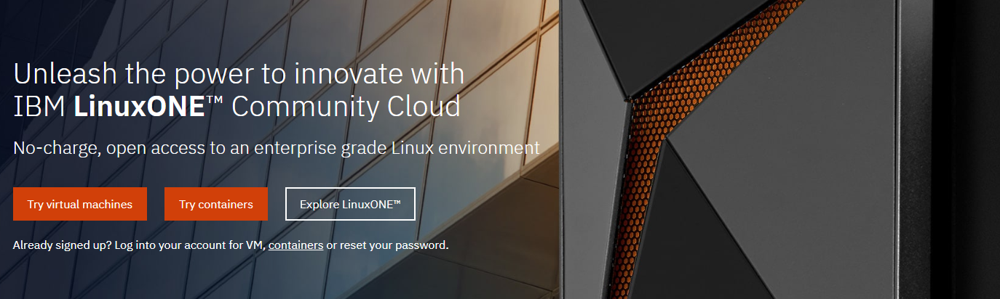
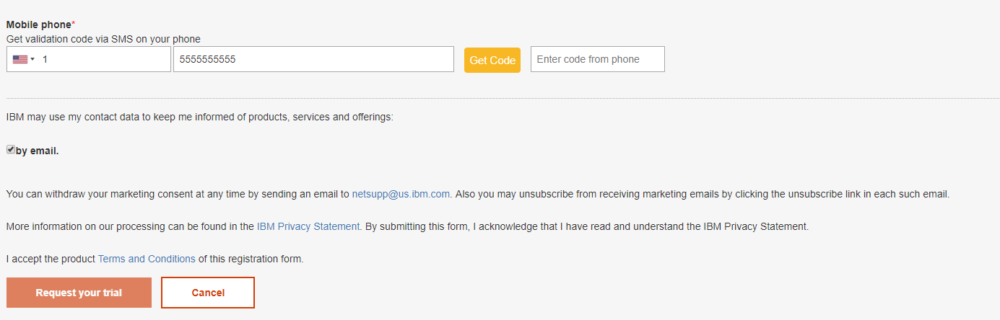
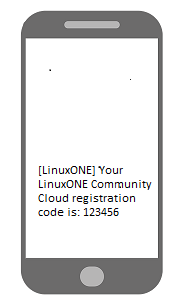
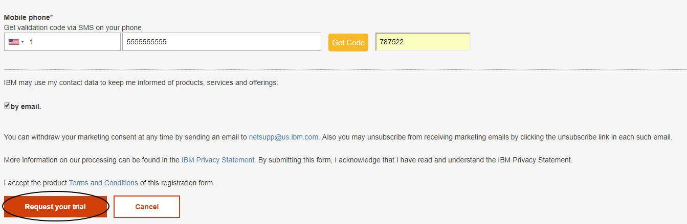
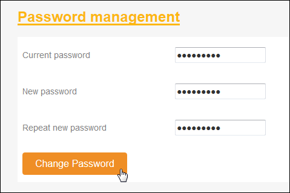
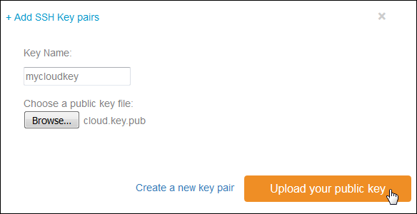

# Virtual Server Deployment Guide

## Overview
This document will take you through the steps to get access to the LinuxONE Community Cloud, deploy a virtual server, create a container and start using them in your projects.    

## Steps

1. Request access to LinuxONE Community Cloud
2. First time setup
3. Deploy your LinuxONE virtual server
4. Log in to your LinuxONE virtual server
5. Create a LinuxONE container
6. Log in to your LinxONE container

## Step 1. Request access to LinuxONE Community Cloud.
1) In a browser, go to the [LinuxONE Community Cloud website](https://developer.ibm.com/linuxone).

   

2) Click **Start your trial** now.

3) Complete the required fields on the registration form.

   

4) Provide a mobile phone number that is capable of receiving SMS messages.
    1) Select a **country code**.
    2) Enter your **mobile phone number**.  *Do not use dashes (-)*.
    3) Click **Get Code**.

   

   >Note: You will see a countdown timer.  If you don’t get a code within a reasonable amount of time, you can request a new one when the timer expires. Do not repeatedly click 'Get Code'.  Each click will send you a new code, invalidating the previous one.

5) Go to your mobile phone and check for an SMS message from LinuxONE.  

   

6) Complete your registration.
    1) Enter the **LinuxONE Community Cloud registration code**.
    2) Click **Request your trial**.

       

7) You will see this THANK YOU page indicating your registration is successful.

   

9) Check your email for registration confirmation and click activation link.

8) You now have access to the LinuxONE Community Cloud self service portal.
    1) Click **Sign In** and use the email address and password you set up previously.

   


## First time setup

1) Back in your browser, from the self service portal login page:
    1) Enter your **user ID** and **password** found in the registration successful email.
    2) Click **Sign in**.

   

2) Now is a good time to change your password to one that is secure and easy for you to remember.

    1) Click your **username** from the upper right corner of the Home page.
    2) Select **Account Settings**.
    3) Provide the necessary information to change your password.

   

   

3) Now is also a good time to create or import an SSH key. An SSH public key is required to deploy Linux instance. The instance can only be accessed with your private key that matches the public key.

    1) Click your **username** from the upper right corner of the Home page.
    2) Select **Manage SSH Key Pairs**.

   

    3) If you already have a public SSH key you wish to use with this cloud:    
        1. Click **Import**.
        2. Enter a **Key Name** for this key.
        3. Browse your local file system to select the **public key path**.
        4. Click **Upload your public key**.

   

    4) If you want to create a new SSH key pair:     
        1. Click **Create**.
        2. Enter a **Key Name** for this key.
        3. Click **Create a new key pair**.   
        4. A pop-up window will appear asking you to save **yourkey. pem** file. This is your private key.  Please save it to a secure location.  Once this operation is complete, there is no way to retrieve this key. Click **OK** to save the file.

   
      

## Deploy your LinuxONE virtual server

1) Go to the **Home** page, **Infrastructure** section and **Virtual Servers** service.
    1. Click **Manage Instances**.

   

    2. Click **Create**.

   

2) Select a virtual server type.

    1. If this server is for generic purpose use, select **General purpose VM**.

   

   2. If this server is for a Hackathon event, select **Hackathon**.  A valid event code is required.

   

3) Provide details information for this instance.  Enter:

    1. An **Instance Name**, without any spaces or special characters.
    2. An **Instance Description**.

   

4) Select the desired Linux image.

   

5) Select the desired flavor (configuration).

   

   >Note: If you selected the **Hackathon** server type, you will not see this section. A flavor of **LinuxONE-Medium** will be selected by default.

6) Select the SSH key to use.

   

7) Verify that all the information is correct and click **Create**.

   

8) Watch the status of your newly deployed instance go through the following phases of start up:  **networking**, **spawning**,  **Active**.  When your instance status changes to active, it is ready for use.

   

   Write down the IP address of your instance. You will need it to log in.

## Log in to your LinuxONE virtual server

### From Mac OS X or Linux using Terminal

1) Open the Terminal application.
2) Ensure that you have the SSH private key used to deploy the server.
3) If you have not done so already, change the permission bits of this key to 600.

   ```sh
   chmod 600 /path/to/key/keyname.pem  
   ```
4) Log in to the linux1 user ID with SSH.

   ```sh
   ssh –i /path/to/key/keyname.pem linux1@serveripaddress
   ```
### From Windows using PuTTY

1) Set up PuTTY to use the SSH key for your server.  Refer to the [Setting up PUTTY on Windows to use ssh private key](http://developer.ibm.com/linuxone/wp-content/uploads/sites/57/2016/02/PUTTY-Set-up.pdf) tutorial.

2) Log in to the linux1 user ID.

## Important notes about your server:
1) You can use ‘sudo’ to execute commands that require root authority.

2) It could take up to 10 minutes to format and mount the /data disk.  Issue the following command to verify the /data disk is available before continuing:
   ```sh
   df -h
   ```
   

3) Firewall is enabled. Only the SSH port is open.  Modify the firewall rules with iptables if you need other ports opened. For example:
   ```sh
   iptables -I INPUT -p tcp --dport <port#> -j ACCEPT
   ```
   If you want to make your changes permanently, issue this command:
   ```sh
   iptables-save > /etc/sysconfig/iptables
   ```

4) You must log in with the user ‘linux1’ with your SSH private key. No modification (use of password authentication, for example) is allowed.

5) The user ‘root’ login is disabled for security reasons. No modification is allowed.

6) There is no backup for your virtual server.  It is the end user’s responsibility to back up any critical data.
