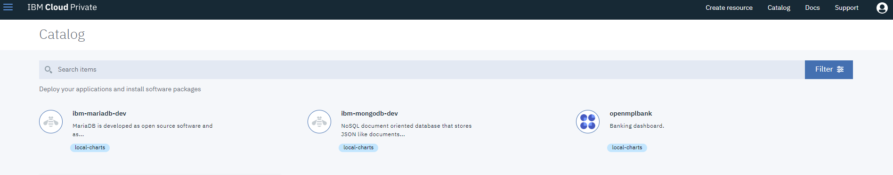
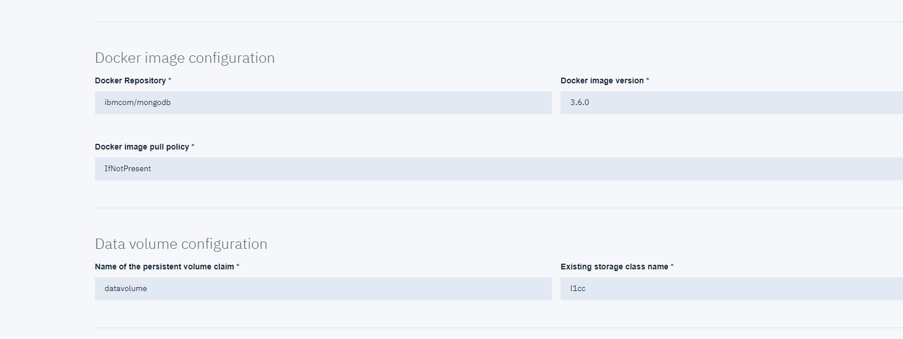
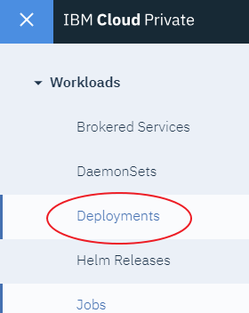

# MongoDB Helm Chart Deployment

## Overview
This document will take you through using the MongoDB Helm Chart preloaded in the LinuxONE Community Cloud IBM Cloud Private container service to deploy your first MondoDB Helm Release.

## Steps

1. Login to IBM Cloud Private
2. Choose the MongoDB helm chart
3. Customize the configuration
4. Deploy/Install the MongoDB Database

## Step 1. Login to IBM Cloud Private

From a browser, go to the [IBM Cloud Private website](https://container.cloud.marist.edu:8443/oidc/login.jsp) and log in with your credentials you previously set up.
    

## Step 2. Choose the MondoDB helm chart

1.  Click the Catalog in the upper right side of screen

    

2.  Select the "ibm-mongodb-dev" helm charts

    

## Step 3. Customize the configuration

1. Customize the MongoDB deployment, paying attention to the "Release name", "Target namespace", agreeing to the license agreements, "MongoDB username" and "Password for MongoDB admin user".  You can take defaults for everything else.

    
    
    

## Step 4.  Deploy/Install the MongoDB Database

1. Click "Install" in lower right corner of screen

    

2. Confirm the installation started with this confirmation...

    

3. Check the status of your MondoDB deployment/install by clicking "Workloads" and then "Deployments" in the upper left hand corner of screen.

    

    

4.  Click the individual deployments to get more details.

    

5.  You can also click "Workloads" and "Helm Releases" to get more details about the Helm Release

    
    
    
