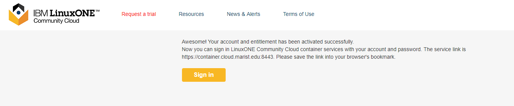
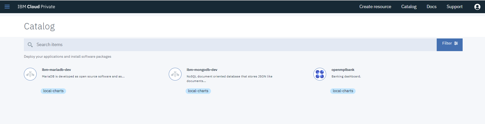
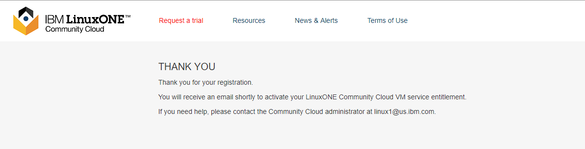
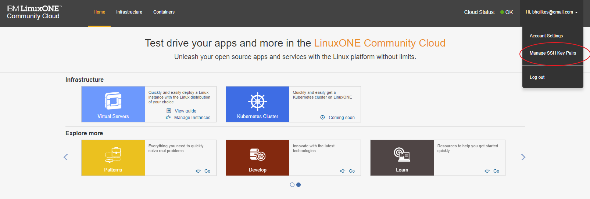
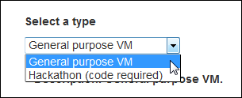
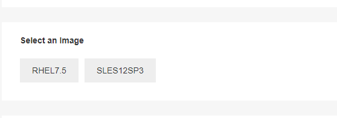

# Develop a Cloud Native Application on ICP on LinuxONE

## Overview
This document will take you through the steps to preview the ICP trial on the LinuxONE Community Cloud that enables the deployment of cloud native applications and more.  

## Important notice
Due to a limitation in the current release, you are not authorized to delete your deployed container resources. This will be fixed in the next release. Please reach out to linux1@us.ibm.com to request the deletion via filling below form.
* Namespace Name:
* Resource Type:
* Resoruce Name:

## Steps

1. Request access to to IBM Cloud Private on the LinuxONE Community Cloud
2. Log in to IBM Cloud Private
3. Create a MongoDB Container Application using Helm Charts
4. Test your MongDB Container Application
5. Create an Open Liberty Container Application using Helm charts
6. Test your Open Liberty Container application
7. Create a Banking Microservice Container Application called MPLBank using Helm charts
8. Use your Banking Microservice Container Application to access DB2 and CICs on zOS

## Step 1. Request access to LinuxONE Community Cloud.
1) In a browser, go to the [LinuxONE Community Cloud website](https://developer.ibm.com/linuxone/home-l1cc30-test/).

   

2) Click **Try containers** now.

3) Complete the required fields on the registration form.

   

4) Provide a mobile phone number that is capable of receiving SMS messages.
    1) Select a **country code**.
    2) Enter your **mobile phone number**.  *Do not use dashes (-)*.
    3) Click **Get Code**.

   

   >Note: You will see a countdown timer.  If you don’t get a code within a reasonable amount of time, you can request a new one when the timer expires. Do not repeatedly click 'Get Code'.  Each click will send you a new code, invalidating the previous one.

5) Go to your mobile phone and check for an SMS message from LinuxONE.  

   

6) Complete your registration.
    1) Enter the **LinuxONE Community Cloud registration code**.
    2) Click **Request your trial**.

       

7) You will see this THANK YOU page indicating your registration is successful.

   

9) Check your email for registration confirmation and click activation link.

   

## Step 2 Log in to the container service   

8) You now have access to the LinuxONE Community Cloud container service.
    1) Click [here](https://container.cloud.marist.edu:8443) and use the email address and password you set up previously.

   [](https://container.cloud.marist.edu:8443)

## Step 3 Navigating the IBM Cloud Private Container Service Interface

1) Once you have logged in with username and password you are presented with a Welcome Page.
   Click [here](https://container.cloud.marist.edu:8443/console/welcome) or bookmark https://container.cloud.marist.edu:8443/console/welcome to get back to the Welcome Page or re-login if you get lost.

2) Once logged in look at the upper right corner of screen and click the Catalog.  This will take you to predefined Helm Charts for you to configure and deploy.
   

3) There are also links to Documentation and Support
    

4) Once you click the catalog you are taken to a catalog of predefined helm charts that can be customized and installed.
    

5) Once installed, click "Workloads" and then "Helm Releases" in the upper left side of screen for a listing of your deployed helm charts.  Also there are many other areas to check out as well.
    
    

## (optional) Add Virtual Server Deployment access to your account

1) Go back to the [Starting Page](https://developer.ibm.com/linuxone/home-l1cc30-test/)

2) Click "Try virtual machines"   
    

3) Enter your email address and you will be immediately recognized as already registered and prompted to add vm service enablement
          

4) Check your email for vm service activation.
    

5) Click the link in your email to activate your vm service.

6) The email and password that you previously set up will now work to log you into the self service portal to create a virtual machine
    Click [here](https://linuxone.cloud.marist.edu/cloud/#/login)
    [](https://linuxone.cloud.marist.edu/cloud/#/login)  

7) Now is a good time to create or import an SSH key. An SSH public key is required to deploy Linux instance. The instance can only be accessed with your private key that matches the public key.

    1) Click your **username** from the upper right corner of the Home page.
    2) Select **Manage SSH Key Pairs**.

   

    3) If you already have a public SSH key you wish to use with this cloud:    
        1. Click **Import**.
        2. Enter a **Key Name** for this key.
        3. Browse your local file system to select the **public key path**.
        4. Click **Upload your public key**.

   

    4) If you want to create a new SSH key pair:     
        1. Click **Create**.
        2. Enter a **Key Name** for this key.
        3. Click **Create a new key pair**.   
        4. A pop-up window will appear asking you to save **yourkey. pem** file. This is your private key.  Please save it to a secure location.  Once this operation is complete, there is no way to retrieve this key. Click **OK** to save the file.

   
      

## Deploy your LinuxONE virtual server

1) Go to the **Home** page, **Infrastructure** section and **Virtual Servers** service.
    1. Click **Manage Instances**.

   

    2. Click **Create**.

   

2) Select a virtual server type.

    1. If this server is for generic purpose use, select **General purpose VM**.

   

   2. If this server is for a Hackathon event, select **Hackathon**.  A valid event code is required.

   

3) Provide details information for this instance.  Enter:

    1. An **Instance Name**, without any spaces or special characters.
    2. An **Instance Description**.

   

4) Select the desired Linux image.

   

5) Select the desired flavor (configuration).

   

   >Note: If you selected the **Hackathon** server type, you will not see this section. A flavor of **LinuxONE-Medium** will be selected by default.

6) Select the SSH key to use.

   

7) Verify that all the information is correct and click **Create**.

   

8) Watch the status of your newly deployed instance go through the following phases of start up:  **networking**, **spawning**,  **Active**.  When your instance status changes to active, it is ready for use.

   

   Write down the IP address of your instance. You will need it to log in.

## Log in to your LinuxONE virtual server

### From Mac OS X or Linux using Terminal

1) Open the Terminal application.
2) Ensure that you have the SSH private key used to deploy the server.
3) If you have not done so already, change the permission bits of this key to 600.

   ```sh
   chmod 600 /path/to/key/keyname.pem  
   ```
4) Log in to the linux1 user ID with SSH.

   ```sh
   ssh –i /path/to/key/keyname.pem linux1@serveripaddress
   ```
### From Windows using PuTTY

1) Set up PuTTY to use the SSH key for your server.  Refer to the [Setting up PUTTY on Windows to use ssh private key](http://developer.ibm.com/linuxone/wp-content/uploads/sites/57/2016/02/PUTTY-Set-up.pdf) tutorial.

2) Log in to the linux1 user ID.

## Important notes about your server:
1) You can use ‘sudo’ to execute commands that require root authority.

2) It could take up to 10 minutes to format and mount the /data disk.  Issue the following command to verify the /data disk is available before continuing:
   ```sh
   df -h
   ```
   

3) Firewall is enabled. Only the SSH port is open.  Modify the firewall rules with iptables if you need other ports opened. For example:
   ```sh
   iptables -I INPUT -p tcp --dport <port#> -j ACCEPT
   ```
   If you want to make your changes permanently, issue this command:
   ```sh
   iptables-save > /etc/sysconfig/iptables
   ```

4) You must log in with the user ‘linux1’ with your SSH private key. No modification (use of password authentication, for example) is allowed.

5) The user ‘root’ login is disabled for security reasons. No modification is allowed.

6) There is no backup for your virtual server.  It is the end user’s responsibility to back up any critical data.
