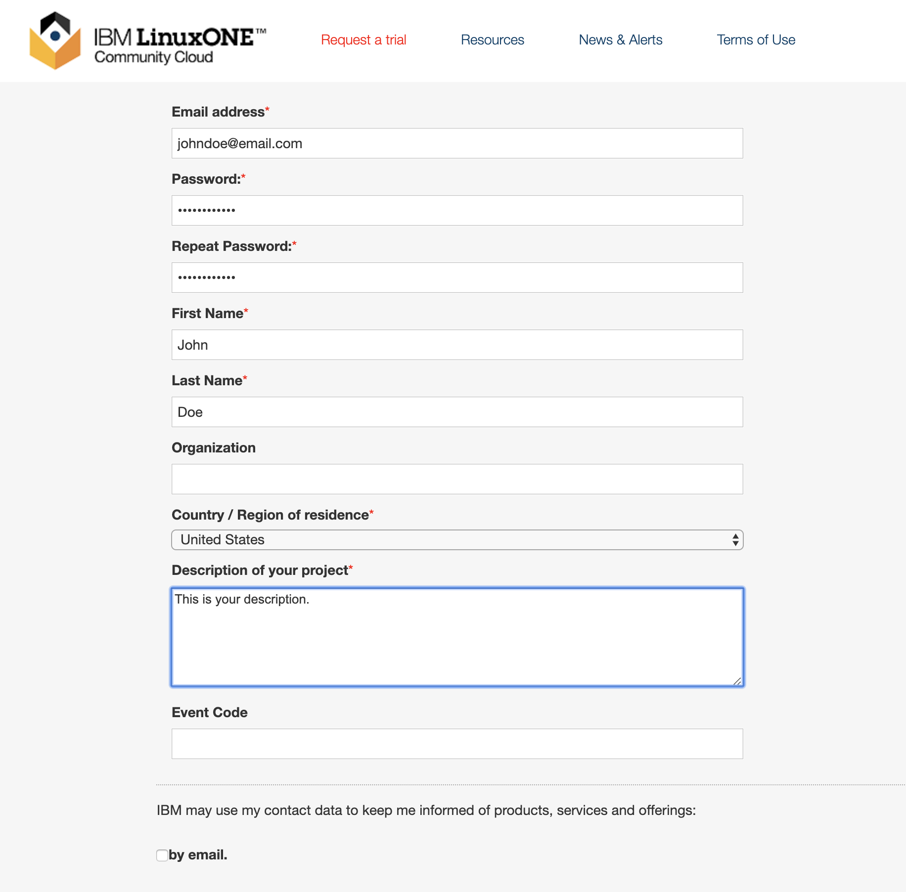
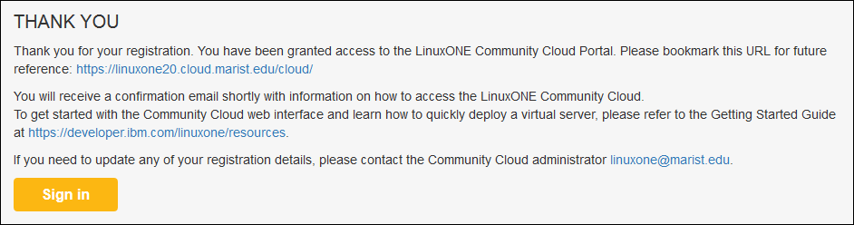

# Virtual Server Deployment Guide

## Overview
This document will take you through the steps to get access to the LinuxONE community cloud, deploy a virtual virtual and start using it in your project.    

## Steps

1. Request access to LinuxONE Community Cloud
2. First time setup
3. Deploy your LinuxONE virtual server
4. Log in to your LinuxONE virtual server

## Step 1. Request access to LinuxONE Community Cloud.
1) In a browser, go to the [LinuxONE Community Cloud website](https://developer.ibm.com/linuxone).
 
   
  
2) Click **Start your trial** now.

3) Complete the required fields on the registration page.

   

4) Provide a mobile phone number that is capable of receiving SMS messages.
    1) Select a country code.
    2)	Enter the mobile phone number.  Do not use dashes (-).
    3)	Click Get Code.
 
   

5) Go to your mobile phone and check for an SMS message from LinuxONE.  

   
 
Note: You will see a countdown timer.  If you don’t get a code, you can get a new one when the timer expires.

6) Complete your registration.
    1) Enter the “LinuxONE Community Cloud registration code”.
    2) Click Request your trial.

       
 
7) You will see this THANK YOU page indicating your registration is successful.
 
   

8) You now have access to the LinuxONE Community Cloud self service portal.
    1) Click Sign In.

9) Check your email for a registration confirmation similar to the following shown. You will need your User ID and Password from this email to sign in to the self service portal.

## First time setup

1) Back in your browser, from the self service portal login page:
   a)	Enter your user ID and password.
   b)	Click Sign in.

2) Now is a good time to change your password to one that is secure easy for you to remember. This can be done after the initial sign in by selecting your username from the upper right corner of the web page and selecting account settings. 
 
3) Now is also a good time to create or import an SSH key.  An SSH public key is required to deploy Linux instance. The instance can only be accessed with your private key that matches the public key.
This can be done by selecting your username from the upper right corner of the web page and selecting Manage SSH Key Pairs.
 
   a) If you already have an public SSH key you wish to use with this cloud:
      1) Click Import. 
      2) Enter a name for this key.
      3) Browse your local file system to select the public key path.
      4) Click Upload your public key.
 
   b) If you want to create a new SSH key pair:
      1) Click Create.
      2) Enter a name for this key.
      3) Click Create a new key pair.
 
      4) A pop-up window will appear asking you to save a yourkey. pem file. This is your private key.  Please save it to a secure location.  Once this operation is complete, there is no way to retrieve this key. 
 
## Deploy your LinuxONE virtual server

1) Go to the **Home** page, Infrastructure section, Virtual Servers.
   a) Click Manage Instances.
   b) Click Create.

2) Complete the following information:
   a)	Select a type:
      1) Select General purpose VM if this server is for generic purpose.
      2) Select Hackathon if this server is for a Hackathon event.  A valid event code is required. 
   b)	Provide details information for this instance.  Enter:
      1) An instance name, without any spaces or special characters. 
      2) An instance description. 
 
   c) Select the desired Linux image.
  
   d)	Select the desired flavor (configuration).
 
   e)	Select the SSH key to use.
 
   f)	Verify that all the information is correct and click Create.
 
3) Watch the status of your newly deployed instance go through the following phases of start up:  networking > spawning > Active.  When your instance status changes to active, it is ready for use.
 
Write down the IP address of your instance. You will need it to log in.

## Log in to your LinuxONE virtual server

### From Mac OS X or Linux using Terminal

1) Open the Terminal application.
2) Ensure that you have the SSH private key used to deploy the server. 
3) If you have not done so already, change the permission bits of this key to 600.
Chmod 600 /path/to/key/keyname.pem 
4) Log in, with SSH, to the linux1 user ID.
ssh –i /path/to/key/keyname.pem linux1@serveripaddress 

### From Windows using PuTTY

1) Set up PuTTY to use the SSH key for your server.  Refer to the Setting up PUTTY on Windows to use ssh private key tutorial.
2) Log in to the linux1 user ID. 

Notes:
1) You can use ‘sudo’ to execute commands that require root authority.
2) It could take up to 10 minutes to format and mount the /data disk.  Issue the following command to verify the /data disk is available before continuing:
ssh –i
 
3) Firewall is enabled. Only the SSH port is open.  Modify the firewall rules with iptables if you need other ports opened. For example:
iptables -I INPUT -p tcp --dport <port#> -j ACCEPT
If you want to make your changes permanently, issue command:
"iptables-save > /etc/sysconfig/iptables" 

 
## Important notes about your deployed Linux server

1) You must log in with the user ‘linux1’ with your SSH private key. No modification (use of password authentication, for example) is allowed.
2) The user ‘root’ login is disabled for security reasons. No modification is allowed.
3) There is no backup for your virtual server.  It is the end user’s responsibility to back up any critical data.
4) Any misuse of the server will result in termination of account immediately without notice.  Please refer the Terms and Conditions for using the LinuxONE Community Cloud.

## Links

https://developer.ibm.com/linuxone/
https://developer.ibm.com/code/
https://developer.ibm.com/linuxone/wp-content/uploads/sites/57/virtual-servers-quick-start.pdf
