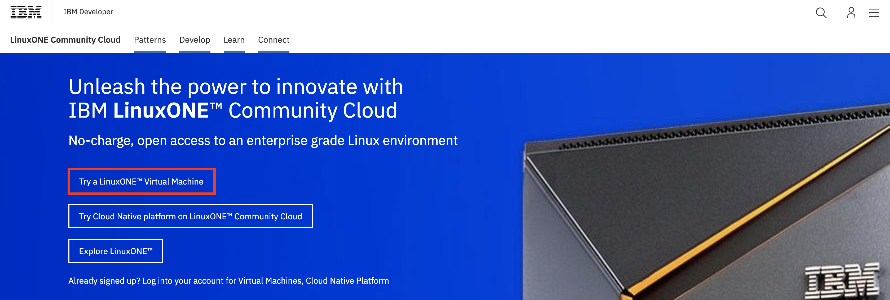
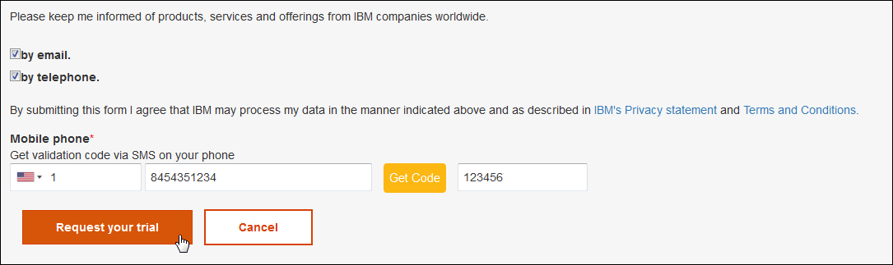
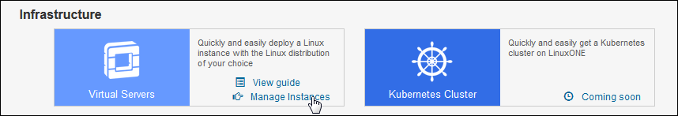
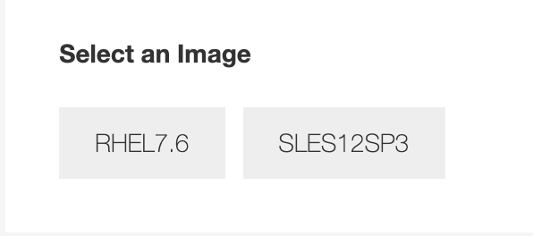

# Virtual Server Deployment Guide

## Overview
This document will take you through the steps to get access to the LinuxONE community cloud, deploy a virtual virtual and start using it in your project.    

## Steps

1. Request access to LinuxONE Community Cloud
2. First time setup
3. Deploy your LinuxONE virtual server
4. Log in to your LinuxONE virtual server

## Step 1. Request access to LinuxONE Community Cloud.
1) In a browser, go to the [LinuxONE Community Cloud website](https://developer.ibm.com/linuxone).

   

2) Click **Try a LinuxONE Virtual Machine** now.

3) Complete the required fields on the registration form.

   


4) Complete your registration by clicking **Request your trial**.

       


5) Check your email for a registration confirmation similar to the following shown. You will need your User ID and Password from this email to sign in to the self service portal.

   


## First time setup

1) After activating your account, log in.

* Enter your **user ID** and the **password** created during registration.
* Click **Sign in**.

   


2) Now is also a good time to create or import an SSH key. An SSH public key is required to deploy Linux instance. The instance can only be accessed with your private key that matches the public key.
* Click your **username** from the upper right corner of the Home page.

* Select **Manage SSH Key Pairs**.


3) If you already have a public SSH key you wish to use with this cloud:    

   * Click **Import**. 
   * Enter a **Key Name** for this key.
   * Browse your local file system to select the **public key path**.
   * Click **Upload your public key**.


4) If you want to create a new SSH key pair:     
* Click **Create**.
* Enter a **Key Name** for this key.
* Click **Create a new key pair**.   
* A pop-up window will appear asking you to save **yourkey. pem** file. This is your private key.  Please save it to a secure location.  Once this operation is complete, there is no way to retrieve this key. Click **OK** to save the file. 


   

## Deploy your LinuxONE virtual server

1) Go to the **Home** page, **Service Catalog** section and **Virtual Servers** service.

* Click **Manage Instances**.

   

* Click **Create**.

   

2) Select a virtual server type.

* If this server is for generic purpose use, select **General purpose VM**.

   
* If this server is for a Hackathon event, select **Hackathon**.  A valid event code is required. 

   

3) Provide details information for this instance.  Enter:

* An **Instance Name**, without any spaces or special characters. 
* An **Instance Description**. 

   

4) Select the desired Linux image.

   

5) Select the SSH key to use.

   

6) Verify that all the information is correct and click **Create**.

   

7) Watch the status of your newly deployed instance go through the following phases of start up:  *NETWORKING*, *SPAWNING*,  *ACTIVE*.  When your instance status changes to *ACTIVE*, it is ready for use.

   

   Write down the IP address of your instance. You will need it to log in.

## Log in to your LinuxONE virtual server

### From Mac OS X or Linux using Terminal

1) Open a Terminal application.
2) Ensure that you have the SSH private key used to deploy the server. 
3) If you have not done so already, change the permission bits of this key to 600.

   ```
   chmod 600 /path/to/key/keyname.pem  
   ```
4) Use SSH to access the Linux guest.

* UserID: linux1

* `-i` lets SSH know which identity file to use access the Linux guest.

* Serveripaddress: This was written down from the *Manage Instances* page of the LinuxONE Community Cloud.

   ```
   ssh –i /path/to/key/keyname.pem linux1@serveripaddress 
   ```
### From Windows using PuTTY

1) Set up PuTTY to use the SSH key for your server.  Refer to the [Setting up PUTTY on Windows to use ssh private key](http://developer.ibm.com/linuxone/wp-content/uploads/sites/57/2016/02/PUTTY-Set-up.pdf) tutorial.

2) Log in to the linux1 user ID. 

## Important notes about your server:
1) You can use ‘sudo’ to execute commands that require root authority.

2) It could take up to 10 minutes to format and mount the /data disk.  Issue the following command to verify the /data disk is available before continuing:
   ```sh
   df -h 
   ```
   

3) Firewall is enabled. Only the SSH port is open.  Modify the firewall rules with iptables if you need other ports opened. For example:
   ```sh
   iptables -I INPUT -p tcp --dport <port#> -j ACCEPT 
   ```
   If you want to make your changes permanently, issue this command:
   ```sh
   iptables-save > /etc/sysconfig/iptables 
   ```

4) You must log in with the user ‘linux1’ with your SSH private key. No modification (use of password authentication, for example) is allowed.

5) The user ‘root’ login is disabled for security reasons. No modification is allowed.

6) There is no backup for your virtual server.  It is the end user’s responsibility to back up any critical data.

